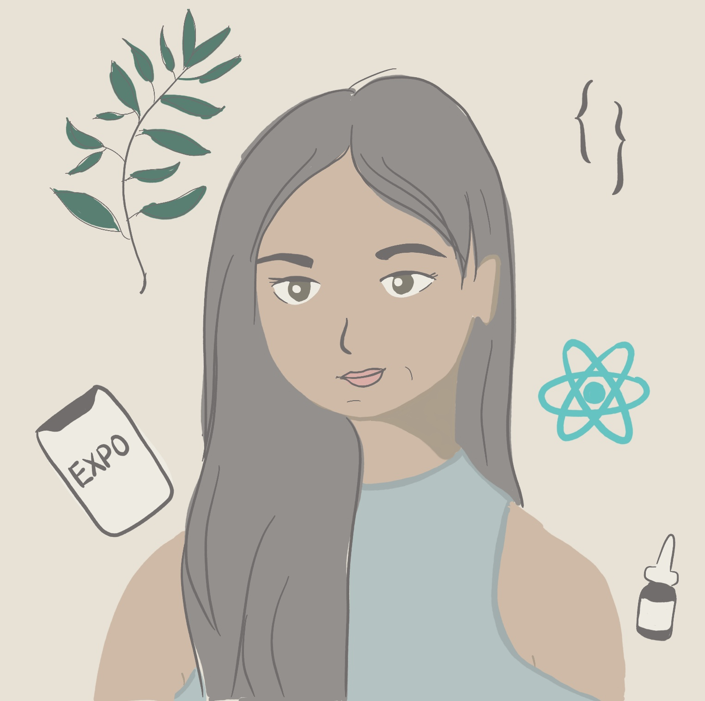

### Hi, I am Emily 👋

I am an app developer and designer. I enjoy designing + building softwares. I have helped people build iOS + Android compatible apps in React Native, migrating their blogs from Tumblr to Github Pages, and building blogs in Next.js! I love researching skincare products, making chain jewelry, and cooking yummy plant-based foods.

- 🔭 I’m currently working on a functional skincare visualization tool!
- 🌱 I’m currently learning to illustrate on Procreate
- 👯 I’m looking to collaborate on an ARKit project
- 🤔 I’m looking for help with finding a gig/job
- 💬 Ask me about building apps with react native and expo
- 📫 How to reach me: kira13zyh@berkeley.edu

